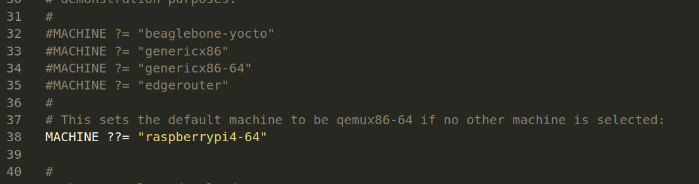

# Building the image using Yocto
## Setting up the environment
 - Make Sure that you have 150 GB free space in your system
 
 - Download Poky build system (Kirkstone branch)
 ```
 git clone -b kirkstone git://git.yoctoproject.org/poky
 ```
 - Download RaspberryPi Board Support Package BSP (Kirkstone branch)
 - Go to poky directory and download the BSP
 ```
 git clone -b kirkstone https://github.com/agherzan/meta-raspberrypi.git 
 ```
 - Download openembedded (kirkstone branch)
 ```
 git clone -b kirkstone https://github.com/openembedded/meta-openembedded.git
 ```
 - Now, we should create our build directory for the image
 ```
 source poky/oe-init-build-env
 ```
 - You should fiind a new directory inside poky called "build"
 
 - Now, we should add the layers needed for our project to BBLAYERS variable
 - make sure to adjust the locations of of these layers according to your needs 
 ```
 bitbake-layers add-layer ../../meta-openembedded/meta-oe/
 bitbake-layers add-layer ../../meta-openembedded/meta-python/
 bitbake-layers add-layer ../../meta-openembedded/meta-gnome/
 bitbake-layers add-layer ../../meta-openembedded/meta-networking/
 bitbake-layers add-layer ../../meta-openembedded/meta-gnome/
 bitbake-layers add-layer ../../meta-openembedded/meta-multimedia/
 bitbake-layers add-layer ../../meta-iti/
 bitbake-layers add-layer ../../meta-raspberrypi/
 bitbake-layers add-layer ../../meta-iti/
 bitbake-layers add-layer ../../meta-openembedded/meta-xfce/
 ```
 - Let's create our layer to keep the poky source unchanged. That we help others to download our layer to build the same image freely
 ```
 bitbake-layers create-layer ~/meta-iti
 ```
 - Edit build/conf/local.conf by changing MACHINE ??= "qemux86-64" to be MACHINE ?= "raspberrypi4-64"
 

## meta-iti layer architecture
- we will follow the same structure of poky/meta to create the hierarchy
- our layer will look like this
```
ahmed@ahmed-ubuntu:~/meta-iti$ tree
.
├── conf
│   ├── bblayers.conf
│   ├── distro
│   │   └── almaza.conf
│   └── layer.conf
├── COPYING.MIT
├── README
├── recipes-example
│   └── example
│       ├── example_0.1.bb
│       ├── example_%.bbappend
│       ├── main.cpp
│       ├── mainwindow.cpp
│       ├── mainwindow.h
│       ├── mainwindow.ui
│       ├── pingapp_0.1.bb
│       ├── rbpiqt.pro
│       └── task_app.py
├── recipes-image
│   └── images
│       └── myimage.bb
└── recipes-kernel
    ├── hello-mod
    │   ├── files
    │   │   ├── COPYING
    │   │   ├── hello.c
    │   │   └── Makefile
    │   └── hello-mod_0.1.bb
    └── linux
        ├── linux-yocto-custom
        │   ├── 0001-linux-version-tweak.patch
        │   ├── feature.scc
        │   └── smp.cfg
        └── linux-yocto-custom.bb
```
### Distro
- Notice that our notice is callled almaza because the a recipe called almaza is found at
```
/meta-iti/conf/distro/
```
- this recipe defines the features will be intsalled with that distro
- this is the content of our almaza distro
```
include meta-poky/conf/distro/poky.conf


DISTRO = "almaza"
DISTRO_NAME = "almaza (Ahmed Abdalla)"
#DISTRO_VERSION = "3.4+snapshot-${METADATA_REVISION}"
DISTRO_VERSION = "1.0"
DISTRO_CODENAME = "kirkstone"

MAINTAINER = "ahmed.m.abdalla650@gmail.com"


#DISTRO_FEATURES:append = " x11 opengl wayland"
DISTRO_FEATURES:append = " x11 opengl wayland"
DISTRO_FEATURES:append = " bluez5 bluetooth wifi ipv4 systemd"

PACKAGECONFIG_FONTS:pn-qtbase = " fontconfig"

INIT_MANAGER = "systemd"

# these 2 variables are the most important 
DISTRO_FEATURES:append = " systemd"
VIRTUAL-RUNTIME_init_manager = "systemd"

#we follwed that file /home/ahmed/poky/meta/conf/distro/include/init-manager-systemd.inc
DISTRO_FEATURES_BACKFILL_CONSIDERED:append = " sysvinit"
VIRTUAL-RUNTIME_initscripts = "systemd-compat-units"
VIRTUAL-RUNTIME_login_manager = "shadow-base"
VIRTUAL-RUNTIME_dev_manager = "systemd"

# Append Python packages to the existing image
#IMAGE_INSTALL_append = " python3 python3-pip python3-setuptools"
```
- Now we need to specify the distro that would be built. This is done through local.conf file located at the directory of build environment


### Image
- Another important recipes found in our layer is myimage found at 
```
/meta-iti/recipes-image/images/myimage.bb
```
- this specifies the the application that will be installed to our image and they will be installed even if we changed the distro
- in our recipe, the repeated installed application is found. Writing them once is enough to get them installed on your image.
- you don't have to write the commented lines in your recipe.
 #### our myimage recipe looks like this
 ```

SUMMARY = "Ahmed Abdalla created this image recipe."

#IMAGE_FEATURES += "splash  hwcodecs "
#IMAGE_FEATURES += "splash hwcodecs"

IMAGE_FEATURES += "splash package-management x11-base x11-sato ssh-server-dropbear ssh-server-openssh hwcodecs"


IMAGE_INSTALL = "packagegroup-core-boot ${CORE_IMAGE_EXTRA_INSTALL}"

IMAGE_INSTALL:append = " apt bash git python3 python3-pip python3-setuptools linux-firmware-ralink linux-firmware-rtl8192cu linux-firmware-rtl8192su linux-firmware-rpidistro-bcm43455 linux-firmware-rtl8192ce"
IMAGE_INSTALL:append = " example pingapp openssh connman connman-client kernel-module-r8188eu dhcpcd bridge-utils hostapd coreutils iptables"
IMAGE_INSTALL:append = " linux-firmware-bcm43430 bluez5 pi-blaster i2c-tools  wpa-supplicant psplash-raspberrypi coreutils iw raspi-gpio"
#QT configuration
IMAGE_INSTALL:append = " make cmake"
IMAGE_INSTALL:append = " qtbase-tools qtbase qtdeclarative qtimageformats qtmultimedia qtquickcontrols2 qtquickcontrols qtbase-plugins cinematicexperience liberation-fonts qtbase-dev curl wget userland gstreamer1.0-plugins-bad qtsvg"

#IMAGE_INSTALL:append = " gtkperf libxslt oracle-jse-jre "
#IMAGE_INSTALL:append = " openjdk-8"
IMAGE_INSTALL:append = " i2c-tools python3-smbus"
#IMAGE_INSTALL:append = " networkmanager"
#IMAGE_INSTALL:append = " libcanberra libcanberra-gtk libcanberra-gtk3"

IMAGE_ROOTFS_EXTRA_SPACE = "2242880"
#================================

DISTRO_FEATURES:append = " bluez5 bluetooth wifi ipv4 systemd"

IMAGE_INSTALL:append = " apt bash git python3 \
                        python3-pip python3-setuptools \
                        linux-firmware-ralink \
                        linux-firmware-rpidistro-bcm43455 \
                        linux-firmware-rtl8192ce"

IMAGE_INSTALL:append = " pingapp openssh \
                        connman connman-client kernel-module-r8188eu \
                        dhcpcd    coreutils iptables"

IMAGE_INSTALL:append = " linux-firmware-bcm43430 bluez5 pi-blaster i2c-tools  \
                        wpa-supplicant    psplash-raspberrypi coreutils iw raspi-gpio"
#=========================

IMAGE_INSTALL:append = " linux-firmware-iwlwifi "
DISTRO_FEATURES:append = " wifi"
IMAGE_INSTALL:append = " iw wpa-supplicant packagegroup-base module-init-tools"
ENABLE_I2C  = "1"
IMAGE_INSTALL:append = " kernel-modules"
IMAGE_INSTALL:append = " i2c-tools"

IMAGE_INSTALL:append = " wpa-supplicant"
#IMAGE_INSTALL:append = " NetworkManager"
IMAGE_INSTALL:append = " python3-smbus"

#=======================

#Bluetooth and Wi-Fi Tools

MAGE_INSTALL:append = " \
    python3 \
    util-linux \
    bluez5 \
    i2c-tools \
    bridge-utils \
    hostapd \
    iptables \
    wpa-supplicant \
    pi-bluetooth \
    bluez5-testtools \
    udev-rules-rpi \
    linux-firmware \
    iw \
    kernel-modules \
    linux-firmware-ralink \
    linux-firmware-rtl8192ce \
    linux-firmware-rtl8192cu \
    linux-firmware-rtl8192su \
    linux-firmware-rpidistro-bcm43430 \
    linux-firmware-bcm43430 \
    connman \
    connman-client \
    dhcpcd \
    openssh \
    psplash \
    psplash-raspberrypi \
    coreutils \
"
# Additional Features and Configuration for WiFi and Bluetooth
DISTRO_FEATURES:append = " \
    bluez5 \
    bluetooth \
    wifi \
    pi-bluetooth \
    linux-firmware-bcm43430 \
    systemd \
    ipv4 \
"
# usrmerge \
#
MACHINE_FEATURES:append = " \
    bluetooth \
    wifi \
"
#
IMAGE_FEATURES:append = " \
    splash \
"
IMAGE_INSTALL:append = " xserver-xorg xf86-video-fbdev xf86-input-evdev xterm matchbox-wm"

pkg_postinst_ontarget_dpkg-start-stop () {
    dpkg-start-stop
}

pkg_postinst_ontarget_util-linux-rev () {
    # Your post-installation script for util-linux-rev here
}

pkg_postinst_ontarget_coreutils () {
    # Your post-installation script for coreutils here
}


#================================

PACKAGE_CLASSES ?= "package_rpm opkg"
IMAGE_INSTALL:append = " opkg"

ENABLE_UART = "1"
ENABLE_I2C = "1"
ENABLE_WIFI = "1"

inherit core-image

#PACKAGE_EXCLUDE = "rust"

# I used these two lines to build core-image-miniml
#IMAGE_ROOTFS_SIZE ?= "8192"
#IMAGE_ROOTFS_EXTRA_SPACE:append = "${@bb.utils.contains("DISTRO_FEATURES", "systemd", " + 4096", "", d)}"

# this found here /home/ahmed/poky/meta/recipes-sato/images
TOOLCHAIN_HOST_TASK:append = " nativesdk-intltool nativesdk-glib-2.0"
TOOLCHAIN_HOST_TASK:remove:task-populate-sdk-ext = " nativesdk-intltool nativesdk-glib-2.0"

QB_MEM = '${@bb.utils.contains("DISTRO_FEATURES", "opengl", "-m 512", "-m 256", d)}'
QB_MEM:qemuarmv5 = "-m 256"
QB_MEM:qemumips = "-m 256"
 ```
 - I have mentioned the most important recipes to build your customized image.
 - you will find other recipes in our layer. They were used to load some application from github and local machine to be installed on our image
### Build the Image
```
bitbake myimage -k
```
- after running this command, you should see something like this


### Flash the Image on SD Card
- Now will find our image at 
```
poky/build/tmp-glibc/deploy/images/raspberrypi4-64
```
- there will be a lot of files but we interseted in file called ```myimage-raspberrypi4-64.wic.bz2``` 
- we run this command to prepare a burnable file 
```
sudo bunzip2 -d -f myimage-raspberrypi4-64.wic.bz2
```
- after finishing, you will find a file called ```myimage-raspberrypi4-64.wic```

- Run the following command to prepare the your sd card
- Note: the minimum size of sd card is 16 GB
- ```before running the command, make your that sd card id found under sdb in /dev```
- ```you can run lsblk command to find out the which file under /dev that represents your storage```
```
sudo dd if=myimage-raspberrypi4-64.wic of=/dev/sdb bs=4M status=progress
```
## Now, I will show you our recipes to fetch the our Dash Board application from the github repo